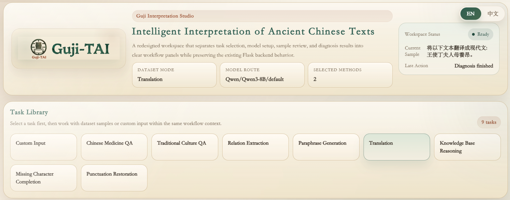

<div align="center">

# Guji-TAI

**Task-Aware Interpretability for Large Language Models in Ancient Chinese Text Processing**

<p>
  
  
  
  
</p>

</div>

  Guji-TAI is a task-aware interpretability framework for ancient Chinese NLP. It is designed for heterogeneous tasks such as punctuation restoration, missing character completion, question answering, translation, relation extraction, and knowledge reasoning.

  Instead of using one fixed explanation object for all tasks, Guji-TAI builds a task-aware target that matches the actual prediction unit of each task. This makes explanations easier to align, compare, and evaluate across different settings.


*Figure 1. Overall Architecture of the Guji-TAI Task-Aware Interpretability Framework.*


## ✨ Highlights

- Task-aware explanation targets for heterogeneous ancient Chinese tasks
- Unified support for multiple interpretability methods
- A shared evaluation protocol with `NAOPC`, `Span-IoU`, and `TTA@k`
- Interactive analysis system based on Flask and Vue

## 🧩 Supported Tasks

- Paraphrase Generation
- Punctuation Restoration
- Missing Character Completion
- Ancient-to-Modern Chinese Translation
- Traditional Culture QA
- Chinese Medicine QA
- Relation Extraction
- Knowledge Base Reasoning

## 📂 Supported Models

- `Qwen/Qwen3-8B`
- `Qwen/Qwen3-32B`
- `Xunzi/Xunzi-Qwen3-8B`
- `internlm/internlm3-8b-instruct`

Model path mapping can be configured in `models/model2path.json`.

## 🛠️ Methods

- `Attention Weights`
- `Attribution`
- `CausalTracing`
- `FiNE`
- `KN`
- `Logit Lens`


## 📖 Installation

```bash
python -m venv .venv
.venv\Scripts\activate
pip install -r requirements.txt
```

If you want to rebuild the frontend, install Node.js as well.

## 🚀 Quick Start

Start the web interface:

```bash
cd GUI
python flask_server.py
```


*Figure 2. Workspace Interface of the Guji-TAI Interpretability Platform.*


